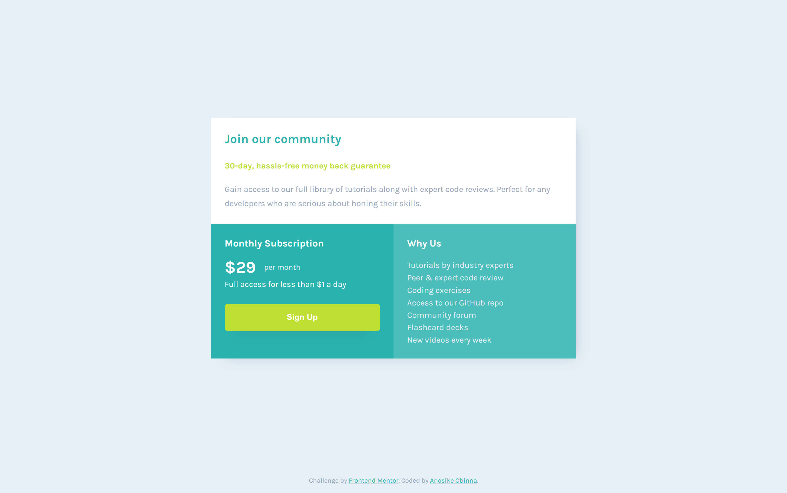

# Frontend Mentor - Single price grid component solution

This is a solution to the [Single price grid component challenge on Frontend Mentor](https://www.frontendmentor.io/challenges/single-price-grid-component-5ce41129d0ff452fec5abbbc). Frontend Mentor challenges help you improve your coding skills by building realistic projects.

## Table of contents

- [The challenge](#the-challenge)
- [Screenshot](#screenshot)
- [Links](#links)
- [Built with](#built-with)
- [Author](#author)

### The challenge

Users should be able to:

- View the optimal layout for the component depending on their device's screen size
- See a hover state on desktop for the Sign Up call-to-action

### Screenshot

### Links

- Solution URL: [Add solution URL here](https://github.com/Smartlify08/single-price-grid)
- Live Site URL: [Add live site URL here](https://ornate-palmier-611a29.netlify.app/)

### Built with

- CSS Grid
- Mobile-first workflow

## Author

- Website - [Add your name here](https://superb-pony-63b1e3.netlify.app/)
- Frontend Mentor - [@yourusername](https://www.frontendmentor.io/profile/Smartlify08)
